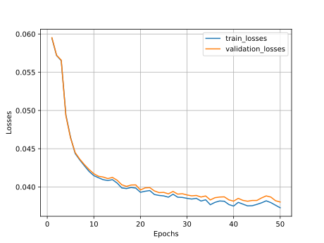
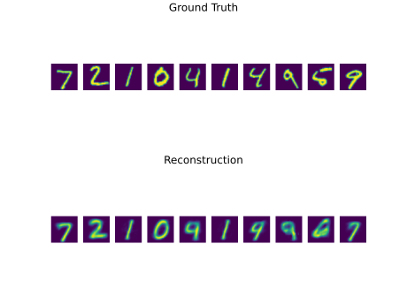
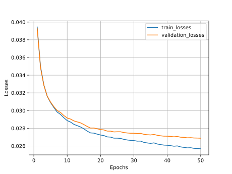
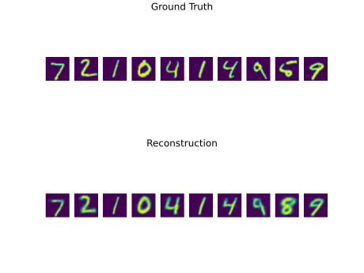

# MNIST-Autoencoder

## Training Linear AE

**---Dataset Information---**
Datasetsize: 70000/
Trainset size: 60000/
Testset size: 10000/

**---Trainingsparameter---**
Model: Linear_AE/
Encoding size: 4/
Number of Epochs: 50/
Train Criterion: MSELoss/
Optimizer: Adam/
Learninrate: 0.001/

## Inference Linear AE

## Training CNN AE
Training parameters:

**---Dataset Information---**
Datasetsize: 70000/
Trainset size: 60000/
Testset size: 10000/

**---Trainingsparameter---**
Model: CNN_AE/
Number of Epochs: 50/
Train Criterion: MSELoss/
Optimizer: Adam/
Learninrate: 0.001/

## Inference CNN AE

## TODO

- [x] save training parameters for each run 
- [ ] create table with training parameters in readme
- [x] reshape readme images 
