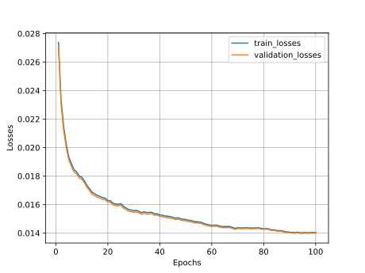

# MNIST-Autoencoder

## Training
Training parameters:

## Inference

## TODO

- [ ] save training parameters for each run 
- [ ] create table with training parameters in readme
- [ ] reshape reame images 
